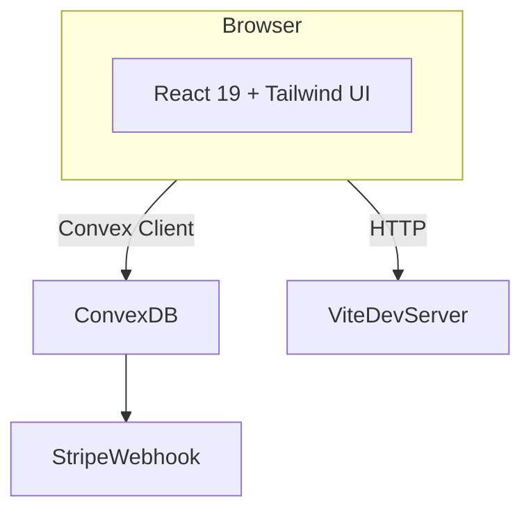

# Architecture Overview
The PreFlight Intake MVP is a **single‑page React 19 application** served via Vite that talks to a **Convex** backend in real time. All package management and scripts are run with **Bun**.

## 1 High-level Diagram (logical)


## 2 Tech Stack Matrix
| Layer | Tech | Notes |
|-------|------|-------|
| UI | React 19, Tailwind, shadcn/ui | Wizard & dashboard components |
| State | React context + URL params | No Redux needed |
| Build | Vite 6 (bun plugin) | `bun run dev` |
| Backend | Convex 1.21‑alpha | Auth, DB, active cron jobs |
| Auth | ConvexAuth (password, anonymous) | Anonymous default role = guest; upgrade to paid via Stripe |
| Payments | Stripe Checkout | Integrated payment flow |
| Tests | Vitest + @testing‑library/react | (TBD) |

### Machine-readable excerpt
```json
{
  "frontend": {
    "framework": "react@19",
    "bundler": "vite",
    "styling": ["tailwind", "shadcn/ui"],
    "state": "context"
  },
  "backend": {
    "db": "convex@1.21-alpha",
    "auth": ["password", "anonymous"],
    "cron": true,
    "payments": "stripe"
  }
}
```

## 3 Directory Layout
```
/specs            ← human+machine docs (this file, mvp_spec, feature specs)
/src              ← React components, hooks, assets
/convex           ← Convex functions & schema (including migrations.ts)
/dist             ← Vite build output (production)
/scripts          ← Helper scripts (e.g., seeding)
```

## 4 Data Flow
1. Browser requests `/` ➜ Vite serves `index.html`.
2. React app mounts and initializes Convex auth. Anonymous users are created with the `guest` role; existing users can sign in with a password.
3. *Guest* users may upgrade: the UI calls the `stripe.createCheckoutSession` action ➜ browser is redirected to Stripe Checkout. A webhook hits `convex/http.ts`, eventually invoking `handleStripeWebhook`, which patches the user to `paid`.
4. *Paid* users can start a questionnaire. Steps are loaded from the `steps` table, answers are persisted via `answers` mutations, and the questionnaire document is patched to `completed` when done.
5. An hourly cron (`send‑reminder‑emails`) invokes `internal.reminders.sendReminderEmails` to notify users with unfinished questionnaires.

## 5 Update Protocol
* **Agent responsibility:** before every commit, parse new/changed code and regenerate:
  * tech stack versions (from `package.json`)
  * directory list (from repo walk)
  * data model snapshot (from `convex/schema.ts`)
  * lastUpdated timestamp.
* The YAML front‑matter is overwritten in place; prose sections are preserved unless structure changes.

## 6 Data Model Snapshot
```json
{
  "questionnaires": {
    "fields": {
      "userId": "Id<\"users\">",
      "status": "string",
      "startedAt": "number",
      "completedAt": "number | null"
    },
    "indexes": ["by_user(userId)", "by_status(status)"]
  },
  "steps": {
    "fields": {
      "prdId": "string",
      "index": "number",
      "type": "string enum('text', 'select', 'multiselect', 'radio', 'slider', 'number')",
      "prompt": "string",
      "title": "string | null",
      "options": "string[] | null"
    },
    "indexes": ["by_prdId(prdId)", "by_index(index)"]
  },
  "answers": {
    "fields": {
      "questionnaireId": "Id<\"questionnaires\">",
      "stepId": "Id<\"steps\">",
      "value": "string | string[] | number",
      "skipped": "boolean"
    },
    "indexes": ["by_questionnaire(questionnaireId)"]
  },
  "users": {
    "fields": {
      "email": "string | null",
      "role": "string | null",
      "isAnonymous": "boolean | null"
    },
    "indexes": ["by_email(email)"]
  }
}
```

---
End of architecture document.

